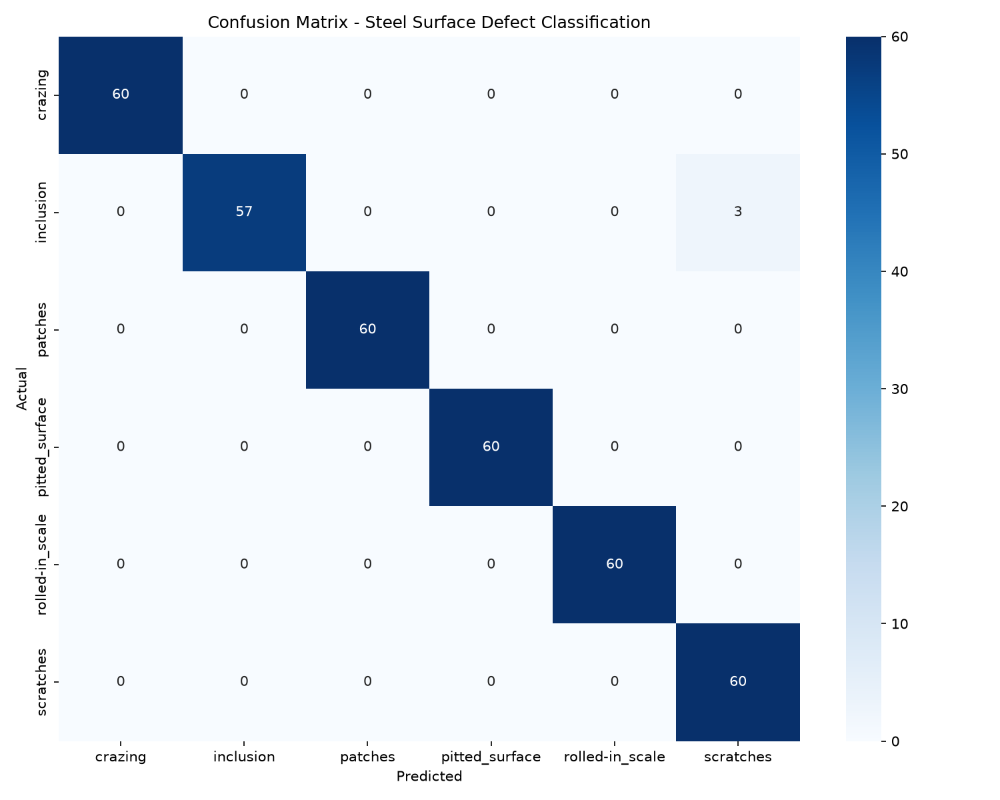

# Steel Surface Defect Analysis 🔩

**🔗 Try it live:** [Steel Defect Inspection System](https://steel-defect-analysis.streamlit.app)

A two-phase project combining SQL, statistical analysis, and deep learning for industrial quality inspection.

- **Phase 1:** SQL database design, EDA, and hypothesis testing on synthetic production data
- **Phase 2:** CNN classifier for steel surface defect detection, deployed as an interactive Streamlit app

---

## Project Overview

### Phase 1 — Data Analytics & SQL
Designed a 3-table MySQL database combining 1,800 real NEU steel defect images with 5,000 synthetic production batches. Wrote advanced SQL (CTEs, window functions, subqueries), performed EDA, and ran statistical tests.

### Phase 2 — Deep Learning & Streamlit App
Built a CNN classifier using MobileNetV2 transfer learning, achieving 98.89% test accuracy. Deployed as a live industrial inspection system with single-image and batch modes.

---

## Phase 2 Results

| Metric | Value |
|--------|-------|
| Test Accuracy | 98.89% |
| Correct | 356/360 |
| Misclassified | 4 |
| F1-Score (Macro) | 0.99 |
| Cross-Validation Mean | 99.56% ± 0.38% |
| Cross-Validation Range | 98.89% – 100.00% |

### Misclassified Images

| File | Actual | Predicted | Confidence |
|------|--------|-----------|------------|
| inclusion_296.jpg | inclusion | scratches | 76.23% |
| pitted_surface_272.jpg | pitted_surface | inclusion | 49.86% |
| pitted_surface_280.jpg | pitted_surface | inclusion | 64.49% |
| pitted_surface_297.jpg | pitted_surface | inclusion | 60.60% |

*Note: pitted_surface vs inclusion is the model's genuine boundary case — confirmed consistently across evaluation scripts and the live app.*

### Confusion Matrix


---

## Known Limitations

- Validation accuracy reached 100% on the NEU dataset's controlled imaging conditions. This does not imply perfect real-world performance.
- Model shows genuine ambiguity between `pitted_surface` and `inclusion` — 3 of 4 misclassified images are this pair.
- Streamlit app may show slightly different confidence values than the evaluation script due to image resizing method. The predicted class remains consistent. Reported metrics are from the evaluation script.
- Phase 1 uses synthetic production data — statistical results describe patterns in that dataset, not verified physical causality.
- TensorFlow 2.15.0 with protobuf 4.25.9 recommended to avoid compatibility warnings.

---

## Debugging Journey — What I Actually Fixed

The model accuracy was easy. The engineering around it was the real work.

1. **Silent model checkpoint mismatch** — Two different `best_model.h5` files existed in separate working directories, causing three contradictory accuracy numbers (97.22%, 98.89%, 99.17%) across different evaluation scripts. Traced via file timestamps and consolidated to a single source of truth.

2. **Caught bad advice before acting on it** — When debugging a preprocessing discrepancy, I verified the actual training script's code rather than trusting a remembered claim about it — the claim turned out to be wrong, and acting on it would have introduced a real bug into working code.

3. **Python version deployment blocker** — Streamlit Cloud defaulted to Python 3.14, for which no TensorFlow wheel exists. `runtime.txt` alone didn't resolve it; fixed via an explicit Python version override in Advanced Settings.

4. **Missing production data for cloud deployment** — Batch Inspection depended on validation images that existed only locally. Resolved by committing a demonstration subset with documented (unknown-license) attribution rather than publishing the full dataset.

The lesson: **A 98.89% accuracy number means nothing if you can't verify how it was produced — and that includes verifying advice before acting on it, not just verifying your own code.**

---

## Deployment

App is live at: **https://steel-defect-analysis.streamlit.app**

**Deployment setup:**
- Python 3.11 pinned via Streamlit Cloud Advanced Settings
- TensorFlow 2.15.0 and Keras 2.15.0 pinned in `requirements.txt` as a precaution to keep the deployed environment consistent with the local training environment
- Validation subset (360 images) committed for batch mode demonstration

---

## Data Attribution

NEU Steel Surface Defect Dataset from [Kaggle](https://www.kaggle.com/datasets/kaustubhdikshit/neu-surface-defect-database). License field on Kaggle lists "Unknown". The validation subset (360 images) is included solely for demonstration of the batch inspection feature. If you are the rights holder and object to this inclusion, open an issue for removal.

The MIT license below applies to the code in this repository only. It does not extend to the NEU-DET dataset images above, or to weights derived from MobileNetV2's pretrained ImageNet base, which is licensed separately by Google/TensorFlow under Apache 2.0.

---

## Project Structure

```
steel-defect-analysis/
├── Phase1_SQL_Analysis/
│   ├── scripts/
│   │   ├── generate_data.py
│   │   ├── load_neu_data.py
│   │   ├── eda.py
│   │   └── statistical_tests.py
│   ├── sql/
│   │   ├── schema.sql
│   │   └── analysis_queries.sql
│   └── fig/
├── Phase2_CNN_Classifier/
│   ├── app.py
│   ├── model_utils.py
│   ├── data_prep.py
│   ├── train_model.py
│   ├── evaluate.py
│   ├── find_errors.py
│   ├── predict.py
│   ├── best_model.h5
│   └── confusion_matrix.png
├── data/raw/NEU-DET/validation/   # Demo subset for cloud
├── README.md
├── LICENSE
├── requirements.txt
├── runtime.txt
└── .gitignore
```

---

## Setup Instructions

### Prerequisites
- Python 3.11
- MySQL (XAMPP)
- Git

### Quick Start
```bash
git clone https://github.com/aftabkhan14022004/steel-defect-analysis.git
cd steel-defect-analysis
pip install -r requirements.txt
```

### Phase 1 Setup
```bash
# Create MySQL database: steel_defects
# Import schema: Phase1_SQL_Analysis/sql/schema.sql
# Download NEU dataset from Kaggle and place in data/raw/

python Phase1_SQL_Analysis/scripts/generate_data.py
python Phase1_SQL_Analysis/scripts/load_neu_data.py
python Phase1_SQL_Analysis/scripts/eda.py
python Phase1_SQL_Analysis/scripts/statistical_tests.py
```

### Phase 2 Setup
```bash
python Phase2_CNN_Classifier/train_model.py
python Phase2_CNN_Classifier/evaluate.py
streamlit run Phase2_CNN_Classifier/app.py
```

---

## Technologies Used
- **Python:** pandas, NumPy, TensorFlow, Keras, Streamlit, scikit-learn
- **SQL:** MySQL, CTEs, window functions, subqueries
- **Visualization:** Matplotlib, Seaborn
- **Deployment:** Streamlit Cloud

---

## Key Learnings
- Designed a normalized relational database with foreign keys
- Wrote production-level SQL (CTEs, window functions, subqueries)
- Built a transfer learning CNN achieving 98.89% test accuracy
- Deployed an interactive industrial inspection system, including resolving a real cloud deployment blocker (Python/TensorFlow wheel incompatibility)
- Diagnosed and fixed a genuine silent model-checkpoint bug that was producing contradictory reported metrics
- Learned to verify claims — including advice from an AI assistant — against actual source files rather than trusting a remembered or reported summary
- Learned that a single impressive-looking accuracy number means little without a reproducible, traceable evaluation process behind it

---

## Future Work
- Database integration for inspection logging (MySQL), connecting to the Phase 1 schema
- Fine-tune MobileNetV2 base layers — requires re-establishing reproducibility (fixed seeds) first, given past instability observed with the frozen-base model
- YOLO for defect localization (bounding boxes)

---

## Author

**Aftab Khan**
📧 aftabkhan14022004@gmail.com
🔗 [LinkedIn](https://www.linkedin.com/in/aftab1402/)
🐙 [GitHub](https://github.com/aftabkhan14022004)

If this project helped you, a ⭐ on GitHub would be appreciated!