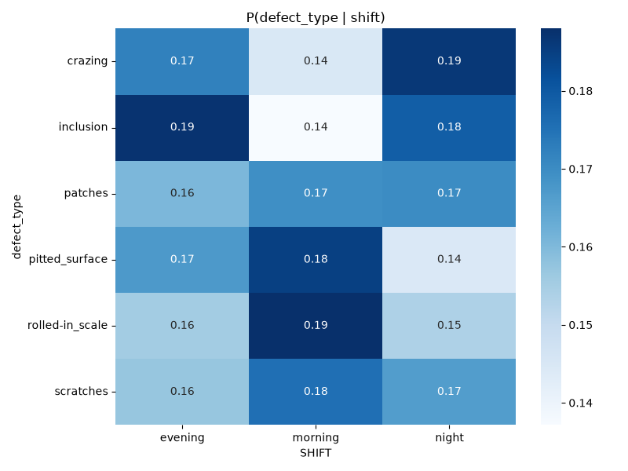

# Steel Surface Defect Analysis 🔩

**🔗 Try it live:** [Steel Defect Inspection System](https://steel-defect-analysis.streamlit.app)

A two-phase project combining SQL, statistical analysis, and deep learning for industrial quality inspection.

- **Phase 1:** SQL database design, EDA, and hypothesis testing on synthetic production data
- **Phase 2:** CNN classifier for steel surface defect detection, deployed as an interactive Streamlit app

---

## Project Overview

This project has two phases: SQL-based statistical analysis on production data (Phase 1), and a deployed CNN classifier for defect detection from images (Phase 2).

### Phase 2 — Deep Learning & Streamlit App
Built a CNN classifier using MobileNetV2 transfer learning, achieving 98.89% test accuracy. Deployed as a live industrial inspection system with single-image and batch modes, Grad-CAM visualization, and MySQL inspection logging.

---

## Phase 1: SQL Analysis & Statistical Testing

### Database Schema
Three normalized tables with foreign keys:
- **production_batches** — batch_id, timestamp, shift, furnace_temp, rolling_speed
- **defect_inspections** — inspection_id, batch_id (FK), defect_type, defect_count
- **machine_parameters** — batch_id (FK), operator_id, machine_id

### Data
- 5,000 synthetic production batches with realistic parameters (furnace temp ~1200°C, rolling speed 5–15 m/min, 3-shift pattern)
- 1,800 real NEU defect images linked to batches
- Deliberate messiness: 2% missing temperatures, 5 duplicate batch IDs, mixed timestamp formats

### SQL Queries Written
1. **Rolling defect rate** — CTE to clean timestamps, then window function for 5-batch moving average
2. **Shift-level aggregation** — CTE joining batches and inspections, grouped by shift
3. **High-defect batches vs machine settings** — Subquery to find batches above overall average

### Statistical Tests

| Hypothesis | Test | p-value | Verdict |
|------------|------|---------|---------|
| Shift affects defect type | Chi-square | 0.126 | Not significant |
| Temperature affects defect rate | Welch's t-test | 0.276 | Not significant |
| Speed correlates with defects | Pearson r | 0.058 | Not significant |

**Key finding:** No single process parameter showed statistical significance in the synthetic tabular data. This motivated Phase 2 — using the actual defect images directly.

### EDA Visualizations
- Defect type distribution
- Defect counts by shift (countplot and boxplot)
- Total defects vs rolling speed (scatter with regression)
- Furnace temperature histogram
- Probability heatmap P(defect_type | shift)



---

## Phase 2 Results

| Metric | Value |
|--------|-------|
| Test Accuracy | 98.89% |
| Correct | 356/360 |
| Misclassified | 4 |
| F1-Score (Macro) | 0.99 |
| Cross-Validation Mean | 99.56% ± 0.38% |
| Cross-Validation Range | 98.89% – 100.00% |

### Misclassified Images

| File | Actual | Predicted | Confidence |
|------|--------|-----------|------------|
| inclusion_296.jpg | inclusion | scratches | 76.23% |
| pitted_surface_272.jpg | pitted_surface | inclusion | 49.86% |
| pitted_surface_280.jpg | pitted_surface | inclusion | 64.49% |
| pitted_surface_297.jpg | pitted_surface | inclusion | 60.60% |

*Note: pitted_surface vs inclusion is the model's genuine boundary case — confirmed consistently across evaluation scripts and the live app.*

### Confusion Matrix


### App Features

- Single-image and batch inspection modes
- Upload your own image(s) OR select from NEU dataset samples
- Top-3 predictions with confidence scores for every inspection
- Low-confidence flag (<50% confidence → flagged for manual review, not auto-classified)
- Grad-CAM visualization showing which image regions influenced each prediction (see Known Limitations — localization is not yet reliable)
- MySQL inspection logging (`inspection_log` table) — every inspection, single or batch, is written to the database
- Logged inspections viewable directly in-app via the "Inspection Logs (Database)" panel
- Success toasts and average-confidence metrics for batch runs
- CSV export and one-click session history clearing
- Consistent 1-based index numbering across all result tables

---

## Known Limitations

- Validation accuracy reached 100% on the NEU dataset's controlled imaging conditions. This does not imply perfect real-world performance.
- Model shows genuine ambiguity between `pitted_surface` and `inclusion` — 3 of 4 misclassified images are this pair.
- Streamlit app may show slightly different confidence values than the evaluation script due to image resizing method. The predicted class remains consistent. Reported metrics are from the evaluation script.
- Phase 1 uses synthetic production data — statistical results describe patterns in that dataset, not verified physical causality.
- TensorFlow 2.15.0, protobuf 4.25.9, numpy 1.26.4, and Streamlit 1.35.0 are pinned together deliberately — newer versions of any of these (especially numpy 2.x or unpinned Streamlit) reintroduce real dependency conflicts encountered during development.
- **OOD detection is NOT solved.** A confidence threshold was tried as a cheap first pass but does not reliably catch true out-of-distribution inputs. Demonstrated: a cat photo scored 80%+ confidence and was classified as "scratches" (wrong). Proper OOD detection requires an embedding-distance or auxiliary-classifier approach.
- **Grad-CAM does not reliably localize defects.** Tested against a known defect location (`inclusion_247.jpg`), the heatmap highlighted regions flanking the visible defect rather than the defect itself. Included as an interpretability starting point, not validated localization — a likely contributing factor is the Global Average Pooling layer immediately following the last convolutional layer, which is a known source of Grad-CAM imprecision in this architecture family.
- **The in-app "Inspection Logs (Database)" panel connects to `localhost` with hardcoded credentials.** This works when running locally but will show a database error on the live Streamlit Cloud deployment, since the cloud server cannot reach a local MySQL instance. Logging itself still succeeds locally; only the in-app *display* of those logs is local-only.

---

## Debugging Journey — What I Actually Fixed

The model accuracy was easy. The engineering around it was the real work.

1. **Silent model checkpoint mismatch** — Two different `best_model.h5` files existed in separate working directories, causing three contradictory accuracy numbers (97.22%, 98.89%, 99.17%) across different evaluation scripts. Traced via file timestamps and consolidated to a single source of truth.

2. **Caught bad advice before acting on it** — When debugging a preprocessing discrepancy, I verified the actual training script's code rather than trusting a remembered claim about it — the claim turned out to be wrong, and acting on it would have introduced a real bug into working code.

3. **Python version deployment blocker** — Streamlit Cloud defaulted to Python 3.14, for which no TensorFlow wheel exists. `runtime.txt` alone didn't resolve it; fixed via an explicit Python version override in Advanced Settings.

4. **Missing production data for cloud deployment** — Batch Inspection depended on validation images that existed only locally. Resolved by committing a demonstration subset with documented (unknown-license) attribution rather than publishing the full dataset.

5. **Keras v3 format conversion and revert** — Attempted converting the model to `.keras` format for cloud compatibility. This was reverted in favor of the original `.h5` file with `keras==2.15.0` pinned in `requirements.txt`, which matched the local training environment and resolved cloud deployment.

6. **Numpy/OpenCV/protobuf/Streamlit dependency conflict** — Adding Grad-CAM (OpenCV) triggered a cascade: OpenCV pulled in numpy 2.x, which broke TensorFlow's compiled extensions (`ml_dtypes` import failure); fixing numpy then exposed a protobuf conflict between TensorFlow (needs <5.0) and an unpinned, newer Streamlit (needs ≥5.26.1). Resolved by pinning the entire dependency chain together (numpy 1.26.4, opencv-python-headless 4.9.0.80, protobuf 4.25.9, Streamlit 1.35.0) and verifying with `pip check` rather than testing packages one at a time.

7. **Grad-CAM graph disconnection on a nested Sequential model** — The initial Grad-CAM implementation assumed the frozen MobileNetV2 submodel's internal tensors were connected to the outer model's graph; loaded from `.h5`, they weren't. Fixed by building the gradient model directly from the submodel's own input and manually continuing the forward pass through the remaining outer layers inside the gradient tape.

8. **Tested Grad-CAM against a known defect location rather than trusting that it "looked plausible."** The heatmap on a genuine `inclusion` image highlighted regions beside the defect, not on it — caught only because the test used an image with an unambiguous, visually verifiable defect location instead of a diffuse defect type where any heatmap would look plausible.

The lesson: **A 98.89% accuracy number means nothing if you can't verify how it was produced — and that includes verifying advice before acting on it, testing new features against known ground truth, and checking that a fix doesn't silently break something else in the same environment.**

---

## Deployment

App is live at: **https://steel-defect-analysis.streamlit.app**

**Deployment setup:**
- Python 3.11 pinned via Streamlit Cloud Advanced Settings
- TensorFlow 2.15.0, Keras 2.15.0, numpy 1.26.4, protobuf 4.25.9, opencv-python-headless 4.9.0.80, and Streamlit 1.35.0 pinned together in `requirements.txt` — this specific combination was required to resolve real dependency conflicts, not chosen arbitrarily
- Validation subset (360 images) committed for batch mode demonstration
- MySQL inspection logging works locally; the live cloud deployment does not have a reachable database, so logging and the in-app log viewer are local-development features only (see Known Limitations)

---

## Data Attribution

NEU Steel Surface Defect Dataset from [Kaggle](https://www.kaggle.com/datasets/kaustubhdikshit/neu-surface-defect-database). License field on Kaggle lists "Unknown". The validation subset (360 images) is included solely for demonstration of the batch inspection feature. If you are the rights holder and object to this inclusion, open an issue for removal.

The MIT license below applies to the code in this repository only. It does not extend to the NEU-DET dataset images above, or to weights derived from MobileNetV2's pretrained ImageNet base, which is licensed separately by Google/TensorFlow under Apache 2.0.

---

## Project Structure

```
steel-defect-analysis/
├── Phase1_SQL_Analysis/
│   ├── scripts/
│   │   ├── generate_data.py
│   │   ├── load_neu_data.py
│   │   ├── eda.py
│   │   └── statistical_tests.py
│   ├── sql/
│   │   ├── schema.sql
│   │   └── analysis_queries.sql
│   └── fig/
├── Phase2_CNN_Classifier/
│   ├── app.py
│   ├── model_utils.py
│   ├── data_prep.py
│   ├── train_model.py
│   ├── evaluate.py
│   ├── find_errors.py
│   ├── predict.py
│   ├── best_model.h5
│   └── confusion_matrix.png
├── data/raw/NEU-DET/validation/   # Demo subset for cloud
├── README.md
├── LICENSE
├── requirements.txt
├── runtime.txt
└── .gitignore
```

---

## Setup Instructions

### Prerequisites
- Python 3.11
- MySQL (XAMPP)
- Git

### Quick Start
```bash
git clone https://github.com/aftabkhan14022004/steel-defect-analysis.git
cd steel-defect-analysis
pip install -r requirements.txt
```

### Phase 1 Setup
```bash
# Create MySQL database: steel_defects
# Import schema: Phase1_SQL_Analysis/sql/schema.sql
# Download NEU dataset from Kaggle and place in data/raw/

python Phase1_SQL_Analysis/scripts/generate_data.py
python Phase1_SQL_Analysis/scripts/load_neu_data.py
python Phase1_SQL_Analysis/scripts/eda.py
python Phase1_SQL_Analysis/scripts/statistical_tests.py
```

### Phase 2 Setup
```bash
python Phase2_CNN_Classifier/train_model.py
python Phase2_CNN_Classifier/evaluate.py

# Set database environment variables before running the app locally:
# DB_HOST, DB_USER, DB_PASSWORD, DB_NAME (see model_utils.py)

streamlit run Phase2_CNN_Classifier/app.py
```

---

## Technologies Used
- **Python:** pandas, NumPy, TensorFlow, Keras, Streamlit, scikit-learn, OpenCV
- **SQL:** MySQL/MariaDB, CTEs, window functions, subqueries
- **Visualization:** Matplotlib, Seaborn, Grad-CAM
- **Deployment:** Streamlit Cloud

---

## Key Learnings
- Designed a normalized relational database with foreign keys
- Wrote production-level SQL (CTEs, window functions, subqueries)
- Built a transfer learning CNN achieving 98.89% test accuracy
- Deployed an interactive industrial inspection system, including resolving a real cloud deployment blocker (Python/TensorFlow wheel incompatibility)
- Diagnosed and fixed a genuine silent model-checkpoint bug that was producing contradictory reported metrics
- Implemented and correctly debugged Grad-CAM on a nested Sequential architecture, including fixing a real graph-disconnection error
- Resolved a cascading dependency conflict (numpy/OpenCV/protobuf/Streamlit) by pinning the full chain together and verifying with `pip check`, rather than fixing one package at a time
- Tested a new interpretability feature against known ground truth and documented an honest negative result instead of assuming it worked
- Learned to verify claims — including advice from an AI assistant — against actual source files rather than trusting a remembered or reported summary
- Learned that a single impressive-looking accuracy number means little without a reproducible, traceable evaluation process behind it

---

## Future Work
- Proper OOD detection (embedding-distance or auxiliary classifier)
- Investigate and fix Grad-CAM's defect-localization accuracy
- No-Defect class (7th class for clean steel surfaces)
- Reachable cloud database so inspection logging and the log-viewer work on the live deployment, not just locally
- Foreign key from `inspection_log` to `production_batches` (currently standalone)
- Operator dashboard with shift-wise analytics
- Real-time camera feed integration
- YOLO defect localization (bounding boxes)
- Fine-tune MobileNetV2 base layers — requires fixed random seeds first, given reproducibility issues observed during development

---

## Author

**Aftab Khan**
📧 aftabkhan14022004@gmail.com
🔗 [LinkedIn](https://www.linkedin.com/in/aftab1402/)
🐙 [GitHub](https://github.com/aftabkhan14022004)

If this project helped you, a ⭐ on GitHub would be appreciated!
